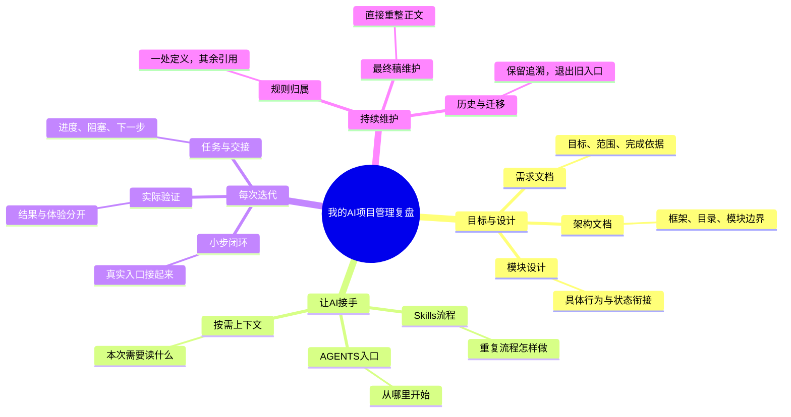

# 我的AI项目管理复盘

与整片一致的四层结构；末层为个人概括和例子，不是新增游戏实现。

```mermaid
mindmap
  root((我的AI项目管理复盘))
    目标与设计
      需求文档
        目标、范围、完成依据
      架构文档
        框架、目录、模块边界
      模块设计
        具体行为与状态衔接
    让AI接手
      AGENTS入口
        从哪里开始
      Skills流程
        重复流程怎样做
      按需上下文
        本次需要读什么
    每次迭代
      小步闭环
        真实入口接起来
      实际验证
        结果与体验分开
      任务与交接
        进度、阻塞、下一步
    持续维护
      规则归属
        一处定义，其余引用
      最终稿维护
        直接重整正文
      历史与迁移
        保留追溯，退出旧入口
```

原始全图随成片附在source-evidence/mindmap.svg；视频中按同一父子结构逐层展开。
